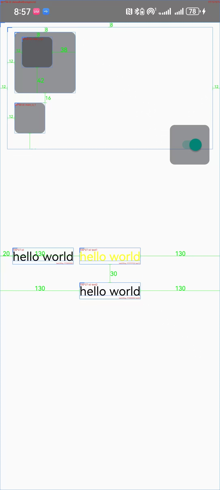

# uichecker

ui检查工具  可以协助开发自查ui边界，文字大小、色值，控件id等，也可协助设计走查
需要悬浮窗权限，以显示悬浮窗控制是否显示边界等信息

使用方法：

Add it in your root build.gradle at the end of repositories:

```kotlin
dependencyResolutionManagement {
	repositoriesMode.set(RepositoriesMode.FAIL_ON_PROJECT_REPOS)
	repositories {
		mavenCentral()
		maven { url 'https://jitpack.io' }
	}
}
```
Step 2. Add the dependency

```kotlin
dependencies {
    debugImplementation 'com.github.weiwei0928:uichecker:1.0.0'
}
```

注意 依赖这个库 打开app会去请求悬浮窗权限，以显示悬浮窗控制是否显示边界等信息

示意图如下：


